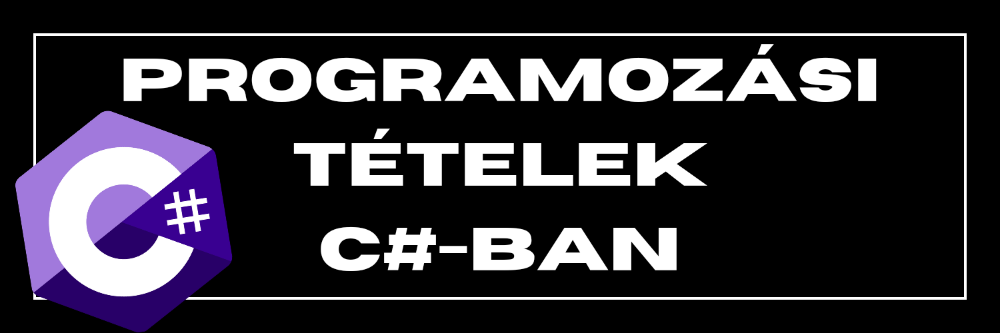

## Tartalomjegyzék [^1]
* [Összegzés tétele](#%C3%B6sszegz%C3%A9s-2)
* [Megszámlálás/megszámolás tétele](#megsz%C3%A1ml%C3%A1l%C3%A1s-2)
* [Kiválasztás tétele](#kiv%C3%A1laszt%C3%A1s-2)
* [Maximum- és minimumkiválasztás tétele](#maximumminimum-kiv%C3%A1laszt%C3%A1s-2)
* [Eldöntés tétele](#eld%C3%B6nt%C3%A9s-2)
* [Keresés tétele](#keres%C3%A9s-2)
* [Kiválogatás tétele](#kiv%C3%A1logat%C3%A1s-2)

## Összegzés [^2]
> Egy adott N nagyságú (/elemű) számsorozat összegére használt eljárás.
```csharp
static void Osszegzes() {
    int[] tomb = {1, 2, 3, 4, 5, 6, 7, 8, 9, 10};
    int n = 10; //vagy ha változhat a tömb száma használjuk a tomb.Count()-ot
    int osszeg = 0;
    for (int i = 0; i < n; i++) {
        osszeg = osszeg + tomb[i]; //vagy osszeg+=tomb[i]
    }
    Console.WriteLine("Végredmény: " + osszeg);
}

```
> [!TIP]
> *C#-ba LINQ verzió*: `tomb.Sum()`


## Megszámlálás [^2]
> Az adott tulajdonsággal rendelkező elemek megszámlálása.
```csharp
static void Megszamlalas() {
    int[] tomb = {1, 2, 3, 4, 5, 6, 7, 8, 9, 10};
    int n = tomb.Length;
    int szamlalo = 0;
    for (int i = 0; i < n; i++) {
        if (tomb[i] % 2 == 0) //feltétel
            szamlalo++;
    }
    Console.WriteLine(" {0} páros szám van", szamlalo);
}

```
> [!TIP]
> *C#-ba LINQ verzió*: `tomb.Count(e => e % 2 == 0)`

## Kiválasztás [^2]
> Tudjuk, hogy a tömb tartalmazza az adott tulajdonságú elemet, csak azt nem tudjuk, hogy hányadik helyen. Ez az algoritmus megkeresi nekünk, és eredményül az elem sorszámával tér vissza.

```csharp
static void Kivalasztas() {
    int[] tomb = {1, 2, 3, 4, 5, 6, 7, 8, 9, 10};
    int n = tomb.Length;
    int keresett_ertek = 5;
    int i = 0;
    while (tomb[i] != keresett_ertek) {
        i++;
    }
    Console.WriteLine("Az 5-ös indexe: {0}", i);
}

```
> [!TIP]
> *C#-ba LINQ verzió*: `Array.IndexOf(tomb, keresett_ertek)`

## Maximum/Minimum kiválasztás [^2]
> Ezzel az algoritmussal egy tömb elemei közül a legnagyobb értékűt tudjuk kiválasztani.

```csharp
static void Maximum() {
    int[] tomb = {2, 3, 4, 5, 1, 9, 8, 7, 6, 10, 1};
    int n = tomb.Length; 
    int max;
    max = tomb[0];
    for (int i = 1; i < n; i++) {
        if (tomb[i] > max) {
            max = tomb[i];
        }
    }
    Console.WriteLine("A legnagyobb elem: {0}", max);
}

```
> [!TIP]
> *C#-ba LINQ verzió*: `tomb.Max()`
<br>

> Ezzel az algoritmussal egy tömb elemei közül a legkisebb értékűt tudjuk kiválasztani.

```csharp
static void Minimum() {
    int[] tomb = {2, 3, 4, 5, 1, 9, 8, 7, 6, 10};
    int n = tomb.Length; 
    int min;
    min = tomb[0];
    for (int i = 1; i < n; i++) {
        if (tomb[i] < min) {
            min = tomb[i];
        }
    }
    Console.WriteLine("A legkisebb elem: {0}", min);
}

```
> [!TIP]
> *C#-ba LINQ verzió*: `tomb.Min()`

> [!IMPORTANT]
> Abban
az esetben, ha nem csak egy legnagyobb elem van az adott tömbben, az algoritmus az első ilyen elem
sorszámával tér vissza.

## Eldöntés [^2]
> Nem tudjuk, hogy egy adott tulajdonságú elem létezik vagy sem a tömbben. Az adott algoritmus, egy logikai értékkel tér vissza. Amennyiben nem található , kiírja az adott szöveget a konzolra.
```csharp
static void Eldontes() {
    int[] tomb = {9, 7, 3, 5, 4, 2, 6, 10, 1};
    int n = tomb.Length;
    int keresett_ertek = 5;
    int i = 0;
    bool vanbenne = false;
    while (i < n && tomb[i] != keresett_ertek) {
        i++;
    }
    if (i < n) {
        vanbenne = true;
        Console.WriteLine("Van benne");
    } else {
        Console.WriteLine("Nincs benne");
    }
}

```
> [!TIP]
> *C#-ba LINQ verzió*: `tomb.Contains(keresett_ertek)`

## Keresés [^2]
> Nem tudjuk, hogy egy adott tulajdonságú 
 elem létezik vagy sem a tömbben. Az adott 
 algoritmus kiírja , hogy ha van benne akkor 
 hanyadik helyen. És visszaad egy 
 értéket (vanbenne), hogy van-e benne vagy 
 nincs.
```csharp
static void Kereses() {
    int[] tomb = {9, 7, 3, 5, 4, 2, 6, 10, 1};
    int n = tomb.Length;
    int keresett_ertek = 5; 
    int i = 0;
    while (i < n && tomb[i] != keresett_ertek) {
        i++;
    }
    if (i < n) {
        Console.WriteLine("Indexe: {0}", i);
    } else {
        Console.WriteLine("Nincs benne");          
    }
}
```
> [!TIP]
> *C#-ba LINQ verzió*:
```csharp
    int? talalat = tomb.FirstOrDefault(x => x == keresett_ertek);
    int index = Array.IndexOf(tomb, talalat.Value);
    if (talalat.HasValue) {
        Console.WriteLine("Indexe: {0}", i);
    } else {
        Console.WriteLine("Nincs benne");          
    }
```

## Kiválogatás [^2]
> Ezzel az algoritmussal egy tömb adott feltételnek megfelelő elemeit kiválogatjuk egy másik tömbbe

```csharp
static void Kivalogatas() {
    int[] eredeti_tomb = {9, 7, 8, 6, 4, 5, 3, 2, 1, 10};
    int n = eredeti_tomb.Length;
    int[] kivalogatott_tomb = new int[n];
    int j = 0;
    for (int i = 0; i < n; i++) {
        if (eredeti_tomb[i] < 10) {
            kivalogatott_tomb[j] = eredeti_tomb[i];
            j++;
        }
    }
    Console.WriteLine("Kiválogatott elemek:");
    for (int i = 0; i < j; i++) {
        Console.Write("{0} ", kivalogatott_tomb[i]);
    }
}
```
> [!TIP]
> *C#-ba LINQ verzió*: `int[] kivalogatott_tomb = a.Where(x => x < 10).ToArray();`

[^1]: Sajnos a mobilos applikációban nem működik, az ékezetes betűk miatt
[^2]: A megjelölt tételek , metódusként vannak megvalósítva
